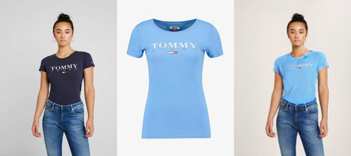
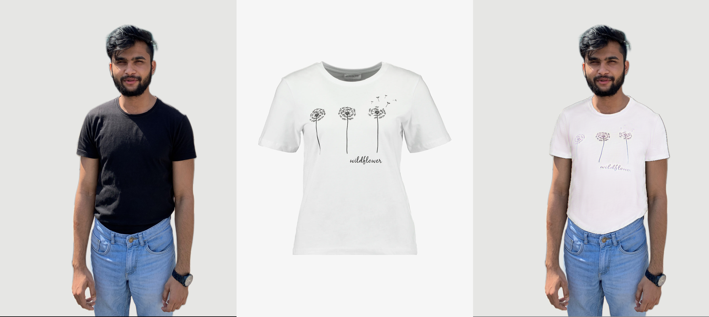
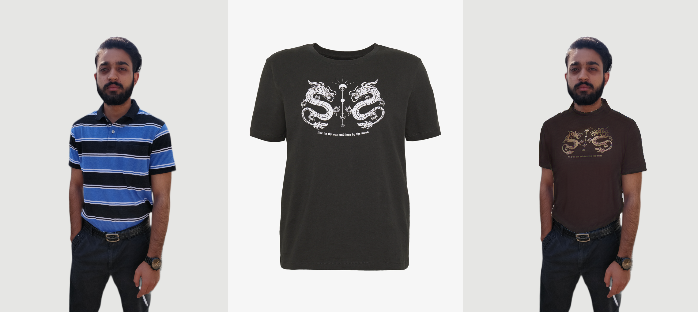
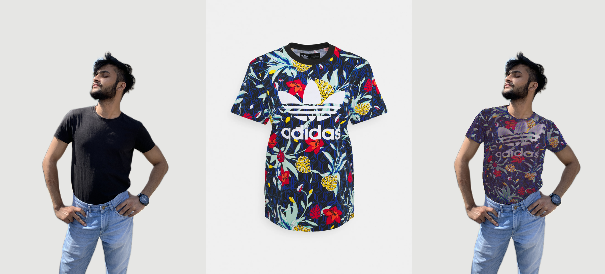
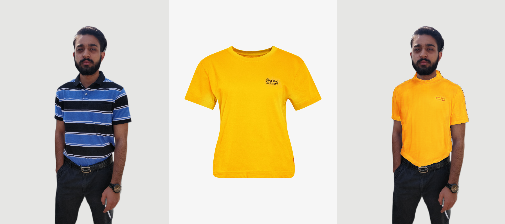
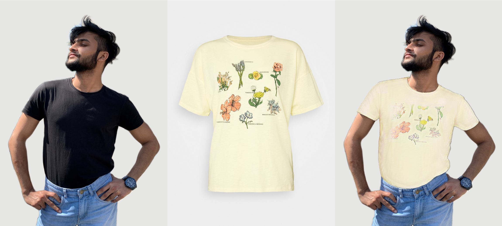
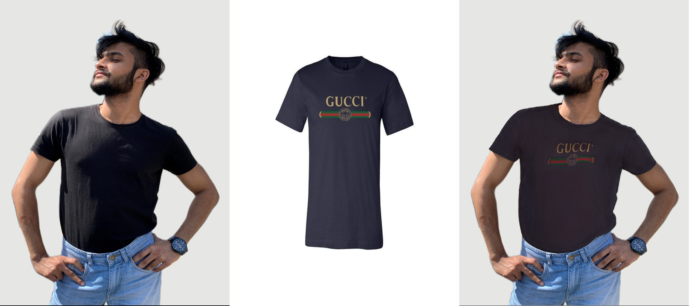

# virtual-try-on
Repo contains results of virtual TryOn algorithm developed by my team at Spyne.ai  
Our results outperform the current SOTA algorithm ACGPN in the task of virtual Tryon
## ACGPN Results 
[[Paper]](https://arxiv.org/abs/2003.05863) [[Code]](https://github.com/switchablenorms/DeepFashion_Try_On)
 

## Our Results

